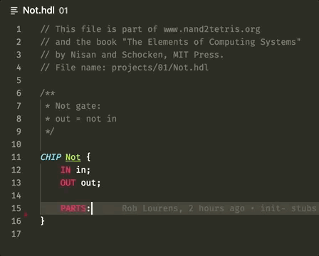

# Nand2Tetris-HDL

This is a fork for the purposes of porting this extension to VSCodium.

Syntax highlighting for the HDL language from the [Nand2Tetris course](http://nand2tetris.org/).

Also contains snippets for all of the basic gate types.

`.tmLanguage` file adapted from https://github.com/t17dr/sublime-nand2tetris/blob/master/nand2tetris_HDL.tmLanguage